## Diagram

```mermaid
flowchart LR
    subgraph internal
    isere(isère) --> httpd(HTTP Server)
    httpd --> http_handler(HTTP Request Handler)
    http_handler -->|execute JavaScript code| js(QuickJS wrapper)
    js --> timer_polyfill(Timer polyfill)
    js --> fetch_polyfill(Fetch polyfill)
    isere --> ini(Configuration*)
    end

    subgraph portable
    isere -->|load JavaScript code| loader(loader.c)
    httpd -->|TCP server| tcp(tcp.c)

    isere -->|get/set DateTime| rtc(rtc.c)

    isere -->|send logs| logger(logger.c)
    ini -->|read/write files| fs(fs.c)
    isere -->|over-the-air update JavaScript code| ota(ota.c*)
    end

    fetch_polyfill -->|TCP Client| tcp

    tcp --> lwip[LwIP]
    tcp --> tusb[TinyUSB RNDIS]
    tusb <--> lwip

    loader --> rom[ROM]
    ota --> rom
```

Note that the component with asterisk (*) is not implemented yet.
For RP2040 port, isere doesn't support over-the-air JavaScript code or configuration update.

In this alpha version, we statically link JavaScript code with the main binary.
Since the main goal is to make it able to run the server for the benchmark.
